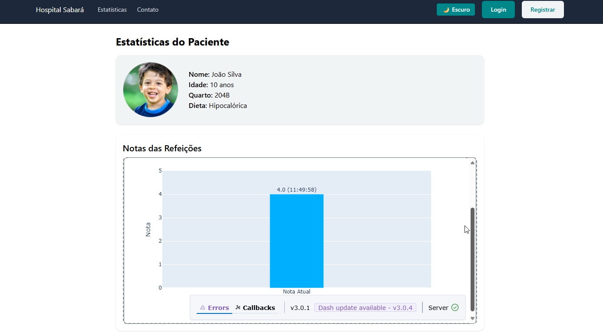

## Autores
**Stack-Society** 
- Vitor de Lima Domingues(RM561008)
- Giovanni Romano Provazi(RM560434)
- João Pedro Vieira de Morais(RM56257)

## Dicas para o projeto

- Na página de estatistícas, colocamos um gráfico que atualiza em tempo real por meio de uma API + MÁQUINA VIRTUAL. Infelizmente não é possível ver sem que nossa VM esteja ligada, mas deixarei uma imagem pra mostrar como a página fica com o gráfico:

